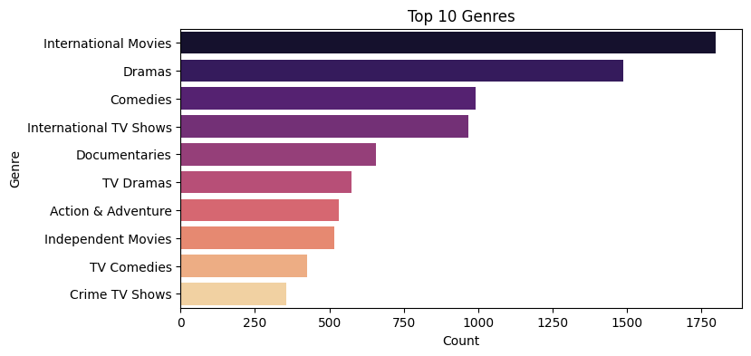
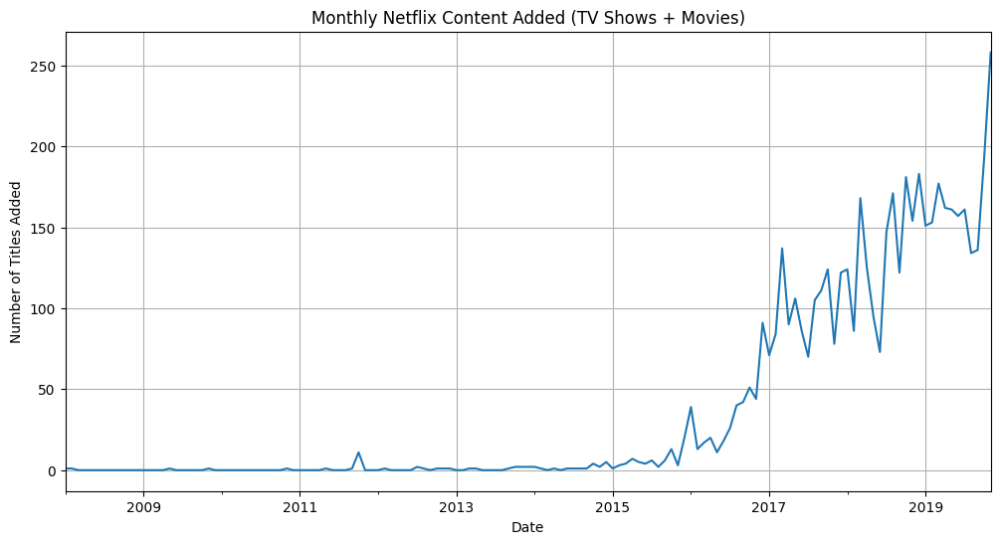
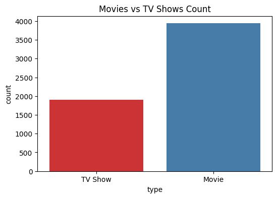

# 📊 Netflix Data Analysis

This repository contains a single Jupyter Notebook focused on exploring and analyzing the **Netflix Titles Dataset (Nov 2019)** using Python. The goal is to extract useful insights from the dataset through data cleaning, exploration, and visualization.

## 🧾 Notebook

- `Netflix_Data_Analysis.ipynb`: The notebook that includes:
  - Loading the dataset
  - Cleaning and handling missing data
  - Exploratory Data Analysis (EDA)
  - Visualizations using Matplotlib and Seaborn
  - Key insights and takeaways

## 🗂️ Dataset

This notebook uses the **Netflix Movies and TV Shows dataset** available on [Kaggle]( https://www.kaggle.com/code/shivamb/netflix-shows-and-movies-exploratory-analysis/input).

**Key Features of the Dataset:**
- Title, Type (Movie/TV Show)
- Director and Cast
- Country of production
- Date added to Netflix
- Release year and rating
- Duration and genres
- Description

### ▶️ Movies vs TV Shows


### 🌍 Country-wise Content Distribution


### 🎭 Genre Distribution


## 🔧 Requirements

Make sure you have the following Python libraries installed:

```bash
pip install pandas numpy matplotlib seaborn
```
**🚀 How to Use:**
- Download the dataset from Kaggle

- Upload it into the same directory as your notebook.

- Open the notebook using Jupyter Notebook, JupyterLab, or Google Colab.

- Run all cells to see the full analysis.

